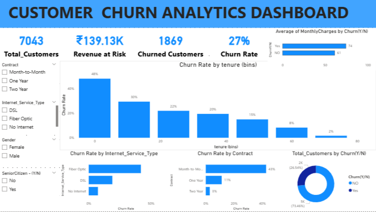

# Customer-Churn-Project

End-to-end Customer Churn Analytics project using SQL, Python, Machine Learning (SMOTE), and Power BI.

This repository contains a complete Customer Churn Analytics project, covering:

✔ Data exploration and preprocessing  
✔ SQL based business analysis  
✔ Feature engineering and imbalance handling (SMOTE)  
✔ Machine Learning (Logistic Regression, Random Forest, XGBoost)  
✔ Performance evaluation focusing on recall and ROC-AUC  
✔ Interactive Power BI dashboard with key churn insights  

The project includes Python notebooks, SQL scripts, and dashboard visuals to showcase a business-ready churn prediction solution.

📌 Project Overview

Customer churn is a major challenge for subscription-based businesses.
This project focuses on analyzing customer behavior, identifying churn drivers,
and predicting high-risk customers using data analytics and machine learning.

The project follows an end-to-end analytics workflow starting from raw data
analysis to business insights and dashboard visualization.

🎯 Problem Statement

Customer churn leads to significant revenue loss.
The objective of this project is to:

Understand why customers leave

Identify high-risk customer segments

Predict churn using machine learning models

Provide actionable insights for retention strategies

📂 Dataset

Dataset: Telco Customer Churn (IBM Sample Dataset)

Each row represents a unique customer

Target variable: Churn (Yes / No)

KEY FEATURES :

Customer tenure

Contract type

Monthly & total charges

Internet and phone services

Payment method

🛠 Tools & Technologies

SQL – Business analysis & churn metrics

Python – Data analysis & machine learning

Libraries: Pandas, NumPy, Matplotlib, Seaborn

Machine Learning: Scikit-learn, XGBoost

Imbalanced Data Handling: SMOTE

Visualization: Power BI

🔄 Project Workflow

Data Understanding & Cleaning

Exploratory Data Analysis (EDA)

Feature Engineering & Preprocessing

Feature Selection & ML Readiness

Handling Class Imbalance using SMOTE

Machine Learning Model Training

Model Evaluation & Comparison

Business Insights & Recommendations

Power BI Dashboard Creation

🤖 MACHINE LEARNING MODELS Used

Logistic Regression

Random Forest

XGBoost

Evaluation Focus:

Recall (Churn = Yes)

ROC-AUC Score
[ROC-AUC Score](Images/churn_roc_curve.png)

Confusion Matrix
[Confusion Matrix](Images/churn_confusion_matrix.png)
📈 Key Results

Customer churn data is highly imbalanced

Month-to-month contracts show the highest churn

Short-tenure customers are more likely to churn

Higher monthly charges increase churn risk

XGBoost achieved the best performance after applying SMOTE

🧠 Business Insights 

Converting month-to-month customers to long-term contracts can reduce churn

Retention efforts should focus on customers with high monthly charges

Early engagement is critical for new customers

Contract type is one of the strongest churn indicators

📊 POWER BI Dashboard

An interactive Power BI dashboard was created to provide:

Total customers & churn rate

Revenue at risk due to churn

Churn by contract, tenure, and services

Interactive filtering for business users

The dashboard helps stakeholders quickly identify high-risk segments and
make data-driven retention decisions.

📁 Repository Structure

Customer-Churn-Project/

│

├── Data/

│   └── churn_dataset.csv / zip

│

├── Notebooks/

│   ├── 1 - Customer_Churn_EDA.ipynb

│   ├── 2 - Customer_Churn_Feature_Engineering_&_Preprocessing_(Churn_Project).ipynb

│   ├── 3 - Customer_Churn_Feature_Selection_&_ML_Readiness.ipynb

│   └── 4 - Customer_Churn_Advanced_ML,_SMOTE_&_Hyperparameter_Tuning.ipynb

│

├── Images/

│   ├──churn_confusion_matrix.png

│   └──churn_roc_curve.png

│

├── SQL_Code/

│   └──Customers_Churm_project

├── churn.pbix

└── README.md

🏆 Final Outcome

This project demonstrates a business-ready Customer Churn Analytics solution
combining SQL, Python, Machine Learning, and Power BI.

It is suitable for:

Data Analyst roles

Business Analyst roles

Entry-level Data Science roles

📌 Author

Jayasurya Mamidi
Aspiring Data Analyst | Python | SQL | Power BI | Machine Learning
